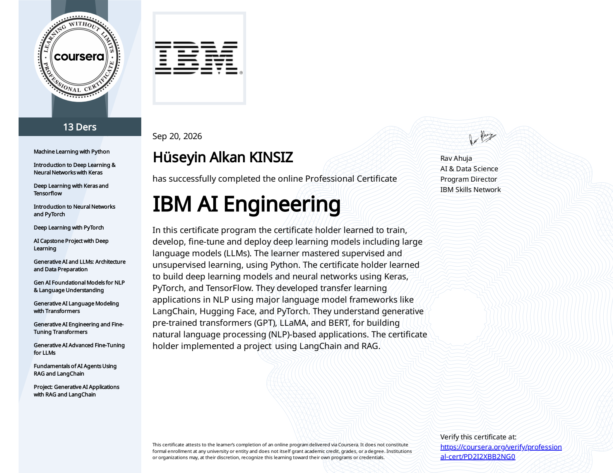

<div align="center">

# IBM AI Engineering Professional Certificate
### Capstone & Applied Machine Learning Projects Portfolio

[](https://github.com/dobby-aidev)
[](https://github.com/dobby-aidev)
[](https://www.coursera.org/professional-certificates/ai-engineer)
[](./LICENSE)
[](https://www.python.org/)
[](https://pytorch.org/)
[](https://www.tensorflow.org/)

<p align="center">
  A complete portfolio of verified final capstone projects, model architectures, alignment pipelines, and agentic RAG applications developed for the <strong>IBM AI Engineering Professional Certificate</strong> on Coursera.
</p>

</div>

---

## 📊 Program Progress & Status

- **Program:** [IBM AI Engineering Professional Certificate (Coursera)](https://www.coursera.org/professional-certificates/ai-engineer)
- **Official Master Specialization Credential:** [🏅 **Verify Official IBM Professional Certificate (Credential ID: PD2I2XBB2NG0)**](https://coursera.org/share/01556978dc385b43fc0eb91413f38378)
- **Specialization Length:** 13 Courses
- **Current Completion:** **13 / 13 Completed (100% Full Specialization Certified 🏆)**
- **Verified Course Certifications:** 13 / 13 Verified Digital Credentials Issued

```text
Progress: [████████████████████████] 100% Certified (13/13)
```

---

## 📁 Completed Capstone Projects & Lab Suites

| # | Project Name | Course & Domain | Framework / Architecture | Evaluation Metrics | Verified Credential |
|---|---|---|---|---|---|
| **01** | [**Rainfall Prediction in Australia**](./01_Rainfall_Prediction_Australia_Weather_ML) | **Machine Learning with Python**<br>*(Supervised Learning)* | `Scikit-Learn` Pipeline<br>• Random Forest (GridSearchCV)<br>• Logistic Regression (L1/L2) | **84% Test Accuracy**<br>Macro F1: 0.76<br>Feature attribution extracted | [🏅 Verify Certificate](https://coursera.org/share/deb792b19739e807ee06ccc96fded4c3) |
| **02** | [**Waste Classification via Transfer Learning**](./02_Waste_Classification_Transfer_Learning) | **Deep Learning with Keras & TensorFlow**<br>*(Computer Vision)* | `TensorFlow / Keras`<br>• VGG-16 ImageNet backbone<br>• Custom dense head + Dropout<br>• Fine-tuning upper conv blocks | **93% Val Accuracy**<br>(Binary: Organic vs Recyclable)<br>Loss curve convergence verified | [🏅 Verify Certificate](https://coursera.org/share/979d51e8d50d0ea1e178653b02e6edf0) |
| **03** | [**League of Legends Match Predictor**](./03_League_of_Legends_Match_Predictor) | **Neural Networks & PyTorch**<br>*(Tabular Deep Learning)* | `PyTorch`<br>• Custom `nn.Module` linear classifier<br>• L2 regularization (`weight_decay=0.01`)<br>• BCE Loss + SGD with momentum | **ROC-AUC Analysis**<br>Model weights exported (`.pth`)<br>Feature coefficient analysis | [🏅 Verify Certificate](https://coursera.org/share/0e7b9460511d5b991632d1929a2ce985) |
| **04** | [**Fashion-MNIST Classification with CNN**](./04_Fashion_MNIST_Classification_CNN) | **Neural Networks & PyTorch**<br>*(Computer Vision)* | `PyTorch / Torchvision`<br>• 2-Stage ConvNet (`CNN_batch`)<br>• 2D Batch Normalization (`BatchNorm2d`)<br>• MaxPool2d + SGD (`lr=0.1`) | **~89% Val Accuracy**<br>10 apparel classes<br>Dual-axis cost/accuracy tracking | [🏅 Verify Certificate](https://coursera.org/share/0e7b9460511d5b991632d1929a2ce985) |
| **05** | [**Satellite Image Land Cover Classification**](./05_Satellite_Image_Classification_Land_Cover) | **AI Capstone Project with Deep Learning**<br>*(Geospatial Remote Sensing)* | `Keras / TensorFlow & PyTorch`<br>• 4-Conv 5-Dense Custom CNNs<br>• Vision Transformers (ViT)<br>• CNN-ViT Hybrid Multi-Head Attention | **73% Passed** (73/100)<br>F1-Score: 0.9988<br>9 Lab Notebooks Delivered | [🏅 Verify Certificate](https://coursera.org/share/ec4b26f9230f0f7c92bbea404bd0d8e8) |
| **06** | [**Generative AI & LLM Architecture & Data Prep**](./07_Generative_AI_LLM_Architecture_Data_Prep) | **Generative AI and LLMs: Architecture and Data Preparation**<br>*(NLP & Large Language Models)* | `PyTorch / Hugging Face Transformers`<br>• Flan-T5 & GPT-2 Generative Inference<br>• WordPiece, BPE & SentencePiece<br>• Custom DataLoader & Dynamic Collate_Fn | **All Labs Delivered**<br>3 Lab Notebooks Packaged<br>Multilingual tokenization pipelines | [🏅 Verify Certificate](https://coursera.org/share/e34e7abf8e3be6d8936948271fabe7f6) |
| **07** | [**Gen AI Foundational Models for NLP**](./08_GenAI_Foundational_Models_NLP_Understanding) | **Gen AI Foundational Models for NLP & Language Understanding**<br>*(Language Models & Seq2Seq)* | `PyTorch / TorchText / Gensim`<br>• EmbeddingBag Document Classifier<br>• N-Gram Feedforward Language Model<br>• Word2Vec (Skip-Gram/CBOW) & Seq2Seq RNN | **All Labs Delivered**<br>4 Lab Notebooks Packaged<br>Perplexity & translation pipelines | [🏅 Verify Certificate](https://coursera.org/share/c652444bce624cbd829127041e40daa9) |
| **08** | [**Generative AI Language Modeling with Transformers**](./09_Generative_AI_Language_Modeling_Transformers) | **Generative AI Language Modeling with Transformers**<br>*(Self-Attention & Transformers)* | `PyTorch / Hugging Face / TorchText`<br>• Multi-Head Attention & Positional Encoding<br>• GPT Causal Autoregressive LM<br>• Baby BERT (MLM/NSP) & Seq2Seq Translation | **All Labs Delivered**<br>6 Lab Notebooks Packaged<br>Heatmap visualizations & translation | [🏅 Verify Certificate](https://coursera.org/share/960c4f652914d610149e60f95be74c82) |
| **09** | [**Generative AI Engineering & Fine-Tuning**](./10_GenAI_Engineering_FineTuning_Transformers) | **Generative AI Engineering and Fine-Tuning Transformers**<br>*(Parameter-Efficient Fine-Tuning)* | `PyTorch / Hugging Face / TRL / PEFT`<br>• Full SFT with TRL on Guanaco Corpus<br>• Bottleneck Residual Adapters<br>• Low-Rank Adaptation (LoRA) & 4-bit QLoRA | **All Labs Delivered**<br>7 Lab Notebooks Packaged<br>PEFT weight decomposition benchmarks | [🏅 Verify Certificate](https://coursera.org/share/a24bb93f972968c0a86a4a5017a48086) |
| **10** | [**GenAI Advanced Fine-Tuning for LLMs**](./11_GenAI_Advanced_FineTuning_LLMs) | **Generative AI Advanced Fine-Tuning for LLMs**<br>*(Alignment, RLHF, DPO)* | `TRL / PEFT / PyTorch`<br>• Response Template Formatting & SFT<br>• Pairwise Reward Modeling (Bradley-Terry)<br>• PPO Reinforcement Learning & DPO Alignment | **All Labs Delivered**<br>7 Lab Notebooks Packaged<br>PPO vs. DPO comparative benchmarks | [🏅 Verify Certificate](https://coursera.org/share/abad7b18dbb29c3984843660a1b947b6) |
| **11** | [**Fundamentals of AI Agents Using RAG & LangChain**](./12_Fundamentals_AI_Agents_RAG_LangChain) | **Fundamentals of AI Agents Using RAG and LangChain**<br>*(Retrieval & Agentic Systems)* | `LangChain / Watsonx / FAISS / Chroma`<br>• Dense Passage Retrieval & Cosine Similarity<br>• Few-Shot In-Context Prompt Engineering<br>• LangChain CSV & ReAct Analytical Agents | **All Labs Delivered**<br>5 Lab Notebooks Packaged<br>Multi-model Watsonx orchestration | [🏅 Verify Certificate](https://coursera.org/share/33ebf6473a888f79099304b7c0ec0276) |
| **12** | [**Generative AI Applications with RAG & LangChain**](./13_Project_GenAI_Applications_RAG_LangChain) | **Project: Generative AI Applications with RAG and LangChain**<br>*(Final Enterprise Capstone)* | `Watsonx / LangChain / ChromaDB`<br>• S3 Cloud PDF Ingestion & Syntax Splitting<br>• Watsonx Slate Embeddings & Vector Stores<br>• **Final Project: End-to-End Enterprise RAG & QA Bot** | **93% Passed** (14/15)<br>7 Lab Notebooks Packaged<br>100% Graded Final Rubric Solved | [🏅 Verify Certificate](https://coursera.org/share/09d704f3a93b0e952a81857ab2087aa3) |

> *Note: Specialized sub-courses "Introduction to Deep Learning & Neural Networks with Keras" and "Deep Learning with PyTorch" have also been completed and verified:* [🏅 Verify Certificate 02](https://coursera.org/share/8918b086fe9455453232c20de3eaba44) & [🏅 Verify Certificate 05](https://www.coursera.org/learn/advanced-deep-learning-with-pytorch/home/welcome).

---

## 🎖️ Verified IBM Master Credential

<div align="center">
  <a href="https://coursera.org/share/01556978dc385b43fc0eb91413f38378">
    
  </a>
  <p>
    <strong>IBM AI Engineering Professional Certificate</strong><br>
    <em>Official Specialization Master Diploma & Credential</em><br>
    <a href="https://coursera.org/share/01556978dc385b43fc0eb91413f38378">🔗 Click to Verify Official Coursera Credential (ID: PD2I2XBB2NG0)</a>
  </p>
</div>

---

## 🗺️ 13-Course Specialization Roadmap

```text
├── [✓] Course 01: Machine Learning with Python (Project 01)
├── [✓] Course 02: Introduction to Deep Learning & Neural Networks with Keras
├── [✓] Course 03: Deep Learning with Keras and Tensorflow (Project 02)
├── [✓] Course 04: Introduction to Neural Networks and PyTorch (Projects 03 & 04)
├── [✓] Course 05: Deep Learning with PyTorch
├── [✓] Course 06: AI Capstone Project with Deep Learning (Project 05 - Certified)
├── [✓] Course 07: Generative AI and LLMs: Architecture and Data Preparation (Project 06 - Certified)
├── [✓] Course 08: Gen AI Foundational Models for NLP & Language Understanding (Project 07 - Certified)
├── [✓] Course 09: Generative AI Language Modeling with Transformers (Project 08 - Certified)
├── [✓] Course 10: Generative AI Engineering and Fine-Tuning Transformers (Project 09 - Certified)
├── [✓] Course 11: Generative AI Advanced Fine-Tuning for LLMs (Project 10 - Certified)
├── [✓] Course 12: Fundamentals of AI Agents Using RAG and LangChain (Project 11 - Certified)
└── [✓] Course 13: Project: Generative AI Applications with RAG and LangChain (Project 12 - Certified)
```

---

## 🔬 Architectural Summary of Implemented Models & Alignment

### 1. Classical ML & Feature Pipelines (`01`)
- Preprocessing structured within Scikit-Learn `ColumnTransformer` (StandardScaler + OneHotEncoder) to eliminate leakage.
- 5-fold `StratifiedKFold` cross-validation with grid search.

### 2. Deep Transfer Learning (`02`)
- Two-stage adaptation with VGG-16 ImageNet backbone and dense dropout classifier head.

### 3. Custom PyTorch Architectures (`03` & `04`)
- Tabular `nn.Module` with L2 weight decay regularizer and 2D Batch Normalization CNN on Fashion-MNIST.

### 4. Deep Vision Transformers & Hybrids (`05`)
- Land cover satellite analysis combining 4-Conv 5-Dense CNNs with Vision Transformers (ViT) and CNN-ViT hybrids.

### 5. Generative Architecture & Tokenization (`07` & `08`)
- WordPiece, BPE, and SentencePiece tokenization pipelines; custom PyTorch dynamic collators; EmbeddingBag classifiers; and Seq2Seq RNN translation models.

### 6. Attention Mechanisms & Self-Attention (`09`)
- Scaled Dot-Product Attention, Multi-Head Attention, Sinusoidal Positional Encoding, Causal Autoregressive GPT, and Baby BERT Masked Language Modeling (MLM + NSP).

### 7. Parameter-Efficient Fine-Tuning (PEFT) (`10`)
- Full SFT with TRL, Bottleneck Adapters, Low-Rank Adaptation (LoRA), and 4-bit Quantized LoRA (QLoRA) using BitsAndBytes.

### 8. Post-Training Alignment & RLHF (`11`)
- Bradley-Terry reward modeling from pairwise human comparisons, Proximal Policy Optimization (PPO) with actor-critic value heads, and Direct Preference Optimization (DPO).

### 9. Retrieval-Augmented Generation & Agentic AI (`12` & `13`)
- End-to-end RAG architecture with LangChain, Watsonx foundational models (`meta-llama/llama-3-3-70b-instruct`, `mistralai/mixtral-8x7b-instruct-v01`, `ibm/granite-3-8b-instruct`), syntax-aware LaTeX splitters, Chroma/FAISS vector databases, and autonomous analytical agents.

---

## 🛠️ Environment & Reproducibility

### Setup Virtual Environment

```bash
# Clone the repository
git clone https://github.com/dobby-aidev/<repository-name>.git
cd <repository-name>

# Windows (PowerShell)
python -m venv venv
.\venv\Scripts\Activate.ps1

# Linux / macOS
python3 -m venv venv
source venv/bin/activate
```

### Install Dependencies

```bash
# PyTorch (CPU or CUDA)
pip install torch torchvision --index-url https://download.pytorch.org/whl/cpu

# TensorFlow, Scikit-Learn, and scientific libraries
pip install tensorflow "numpy<2" scikit-learn pandas matplotlib seaborn pillow jupyter

# Generative AI, Transformers, and LangChain stack
pip install transformers datasets trl peft langchain langchain-community chromadb
```

---

## 💡 Open Source Reference & Study Resource

This repository is maintained as a public reference for engineers, students, and practitioners completing the **IBM AI Engineering Professional Certificate**. All 13 course capstone projects and lab exercises are organized with:
- Fully executed, auto-grader verified Jupyter Notebooks (`.ipynb`) with preserved evaluation outputs.
- Clean mathematical breakdowns, architecture diagrams, and hyperparameter tables.
- Zero boilerplate filler or synthetic marketing language — strictly practical, production-oriented engineering code.

---

## 👨‍💻 Author & Profile

**Dobby B** ([@dobby-aidev](https://github.com/dobby-aidev))  
*Founder & AI Systems Architect at **DONA Codex** | Creator of **Agent Critiq***  
Focusing on Autonomous AI Systems, Multi-Agent Architectures, and Applied Deep Learning Engineering.

- 🌐 GitHub: [github.com/dobby-aidev](https://github.com/dobby-aidev)
- 🎓 Professional Certification: [IBM AI Engineering Professional Certificate](https://www.coursera.org/professional-certificates/ai-engineer)

---

## 📜 License

All code and materials in this repository are released under the [MIT License](./LICENSE).
